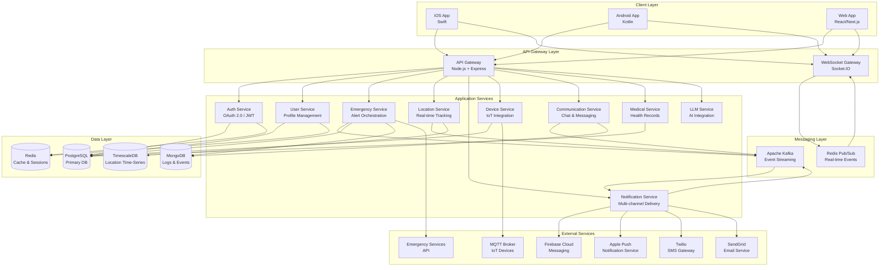
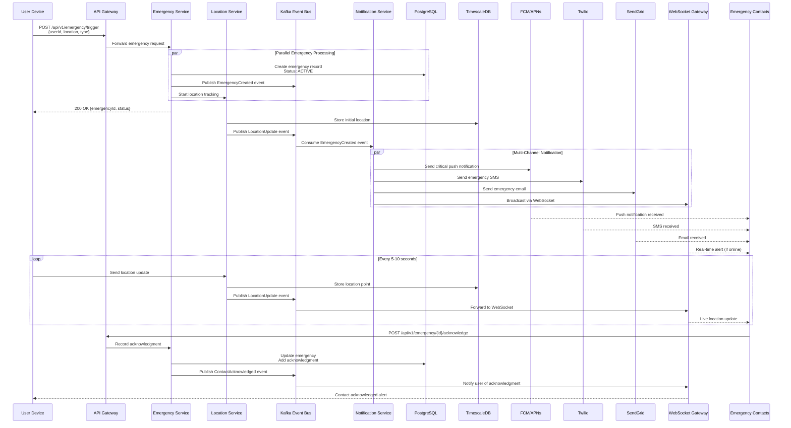
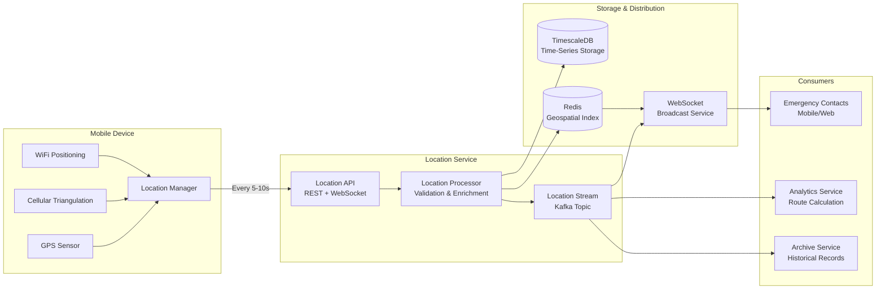
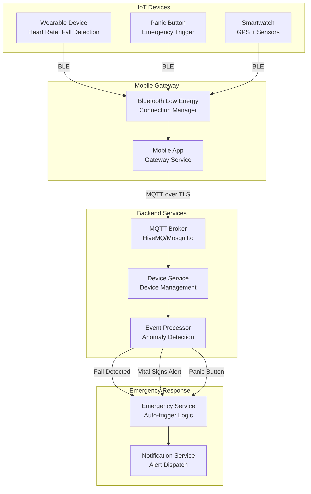
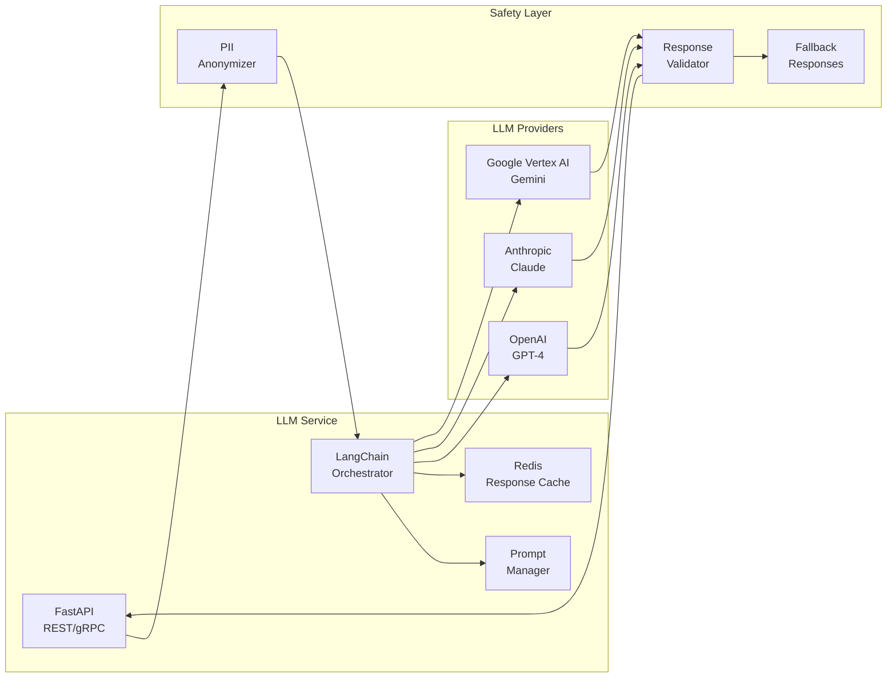

# sos-app - Task 95

Execute task 95 for the sos-app specification.

## Task Description
Implement Redis geospatial cache

## Requirements Reference
**Requirements**: 3.0, Performance NFR

## Usage
```
/Task:95-sos-app
```

## Instructions

Execute with @spec-task-executor agent the following task: "Implement Redis geospatial cache"

```
Use the @spec-task-executor agent to implement task 95: "Implement Redis geospatial cache" for the sos-app specification and include all the below context.

# Steering Context
## Steering Documents Context

No steering documents found or all are empty.

# Specification Context
## Specification Context (Pre-loaded): sos-app

### Requirements
# Requirements Document: SOS App

## Introduction

The SOS App is a comprehensive emergency response application designed to provide immediate assistance during critical situations. The application serves as a lifeline for users facing emergencies, enabling them to quickly request help, share their location, notify emergency contacts, and communicate with responders. The platform is built with a decoupled architecture supporting both web and mobile interfaces, with the capability to integrate with external IoT devices (wearables, panic buttons) and future AI/LLM capabilities for intelligent emergency assessment and response.

**Value Proposition:**
- **Rapid Response**: Reduce emergency response time through instant alert mechanisms
- **Universal Access**: Available across web and mobile platforms for ubiquitous access
- **Smart Integration**: Connect with external devices for automated emergency detection
- **Future-Ready**: Architecture designed to incorporate AI-powered emergency assessment and guidance
- **Reliable Communication**: Ensure critical information reaches the right people at the right time

## Alignment with Product Vision

This application represents a complete emergency response ecosystem that prioritizes:
- **User Safety**: Primary focus on getting help to users as quickly as possible
- **Accessibility**: Multi-platform support ensures help is available regardless of device
- **Scalability**: Decoupled architecture allows for independent scaling of web, mobile, and backend services
- **Extensibility**: Integration capabilities with IoT devices and LLM services for enhanced functionality
- **Reliability**: Critical system design for 99.9% uptime and fault tolerance

## Requirements

### Requirement 1: User Registration and Authentication

**User Story:** As a user, I want to register and securely authenticate to the SOS app, so that my emergency profile and contacts are readily available when needed.

#### Acceptance Criteria

1. WHEN a new user accesses the application THEN the system SHALL provide registration options including email/password, phone number, and social authentication (Google, Apple)
2. WHEN a user registers THEN the system SHALL collect essential emergency profile information including full name, blood type, medical conditions, allergies, and emergency contacts
3. WHEN a user attempts to log in THEN the system SHALL authenticate credentials and provide secure session management with token-based authentication
4. IF a user forgets their password THEN the system SHALL provide password reset via email or SMS verification
5. WHEN a user logs in THEN the system SHALL sync their profile across all devices (web and mobile)
6. IF biometric authentication is available on the device THEN the system SHALL offer fingerprint or face recognition as a quick login option

### Requirement 2: Emergency Alert Triggering

**User Story:** As a user in an emergency situation, I want to quickly trigger an SOS alert with minimal interaction, so that help can be dispatched immediately without complex navigation.

#### Acceptance Criteria

1. WHEN a user presses the emergency button THEN the system SHALL immediately trigger an SOS alert within 2 seconds
2. WHEN an SOS alert is triggered THEN the system SHALL capture the user's current GPS location with accuracy within 10 meters
3. WHEN an alert is sent THEN the system SHALL notify all designated emergency contacts via push notification, SMS, and email simultaneously
4. IF the user has designated emergency services to be notified THEN the system SHALL send alert details to local emergency dispatch services
5. WHEN an emergency is triggered THEN the system SHALL provide a countdown timer (5-10 seconds) allowing accidental trigger cancellation
6. IF the user cannot interact with the device THEN the system SHALL support voice-activated emergency triggering with a designated phrase
7. WHEN an alert is active THEN the system SHALL display a prominent emergency status indicator on all screens
8. IF location services are disabled THEN the system SHALL prompt the user and request permission before sending the alert

### Requirement 3: Real-Time Location Sharing

**User Story:** As an emergency responder or emergency contact, I want to see the real-time location of the person in distress, so that I can reach them as quickly as possible.

#### Acceptance Criteria

1. WHEN an SOS alert is active THEN the system SHALL continuously update the user's location every 5-10 seconds
2. WHEN an emergency contact views the alert THEN the system SHALL display the user's location on an interactive map with route navigation options
3. IF the user is moving THEN the system SHALL show a location trail with timestamps for the last 30 minutes
4. WHEN network connectivity is poor THEN the system SHALL cache location updates and transmit them when connectivity is restored
5. IF GPS is unavailable THEN the system SHALL use cell tower triangulation or Wi-Fi positioning as fallback location methods
6. WHEN location is shared THEN the system SHALL display accuracy radius to indicate location precision

### Requirement 4: Emergency Contact Management

**User Story:** As a user, I want to designate and manage multiple emergency contacts with priority levels, so that the right people are notified based on the emergency type.

#### Acceptance Criteria

1. WHEN a user adds an emergency contact THEN the system SHALL store contact name, phone number, email, relationship, and priority level (primary, secondary, tertiary)
2. WHEN an SOS is triggered THEN the system SHALL notify contacts in priority order with primary contacts receiving immediate notification
3. IF a primary contact does not acknowledge within 2 minutes THEN the system SHALL escalate to secondary contacts
4. WHEN a contact is notified THEN the system SHALL provide options to acknowledge, view location, call the user, or contact emergency services
5. WHEN a user updates emergency contacts THEN the system SHALL require re-authentication for security
6. IF a contact's phone number or email is invalid THEN the system SHALL warn the user during setup and validation

### Requirement 5: Emergency Profile and Medical Information

**User Story:** As a first responder, I want immediate access to the user's critical medical information, so that I can provide appropriate emergency care.

#### Acceptance Criteria

1. WHEN an emergency profile is created THEN the system SHALL collect blood type, allergies, chronic conditions, current medications, and emergency medical notes
2. WHEN an SOS alert is sent THEN the system SHALL include a secure link to the user's medical information accessible by emergency contacts and responders
3. IF the user is unresponsive THEN the system SHALL display medical information on the lock screen (configurable setting) for first responders
4. WHEN medical information is accessed THEN the system SHALL log who viewed the information and when for privacy tracking
5. IF critical information changes THEN the system SHALL prompt the user to update their emergency profile

### Requirement 6: Multi-Platform Support (Web and Mobile)

**User Story:** As a user, I want to access the SOS app from both my phone and computer, so that I can request help regardless of which device I have available.

#### Acceptance Criteria

1. WHEN the application is deployed THEN the system SHALL provide native mobile apps for iOS and Android platforms
2. WHEN the application is deployed THEN the system SHALL provide a responsive web application accessible via modern browsers
3. WHEN a user logs in on any platform THEN the system SHALL synchronize their profile, contacts, and settings across all devices
4. WHEN an SOS is triggered from one device THEN all logged-in devices SHALL reflect the emergency status
5. IF the mobile app is installed THEN the system SHALL support background location tracking during active emergencies
6. WHEN using the web application THEN the system SHALL request browser permissions for location, notifications, and camera access

### Requirement 7: External Device Integration

**User Story:** As a user with wearable devices or panic buttons, I want the SOS app to integrate with these devices, so that emergencies can be automatically detected or triggered without needing my phone.

#### Acceptance Criteria

1. WHEN a compatible wearable device is paired THEN the system SHALL support emergency triggering via the wearable button
2. IF a fall is detected by a wearable device THEN the system SHALL automatically trigger an SOS alert after 30 seconds without user response
3. WHEN a panic button device is registered THEN the system SHALL accept emergency triggers from the device via Bluetooth or Wi-Fi
4. IF heart rate or other vital signs exceed danger thresholds THEN the system SHALL prompt the user and offer to trigger an emergency alert
5. WHEN external devices are connected THEN the system SHALL monitor device battery levels and alert users when batteries are low
6. IF device connectivity is lost THEN the system SHALL notify the user and provide troubleshooting steps

### Requirement 8: Communication During Emergencies

**User Story:** As a user in an emergency, I want to communicate with my emergency contacts and responders, so that I can provide updates and receive guidance.

#### Acceptance Criteria

1. WHEN an SOS is active THEN the system SHALL provide an emergency chat interface connecting the user with emergency contacts
2. WHEN a user cannot type THEN the system SHALL support voice-to-text messaging for hands-free communication
3. IF the user enables media sharing THEN the system SHALL allow photos and videos to be sent to emergency contacts to show the situation
4. WHEN an emergency contact responds THEN the system SHALL deliver messages with high priority push notifications
5. IF the user is unable to communicate THEN the system SHALL provide quick-response buttons (e.g., "Need Ambulance", "Trapped", "Fire", "Medical Emergency")
6. WHEN audio/video call is initiated THEN the system SHALL prioritize emergency calls over network bandwidth

### Requirement 9: Emergency History and Reporting

**User Story:** As a user, I want to review my past emergency alerts and activities, so that I can track incidents and provide documentation if needed.

#### Acceptance Criteria

1. WHEN an emergency is resolved THEN the system SHALL archive the incident with timestamp, location, duration, and responses received
2. WHEN a user views emergency history THEN the system SHALL display all past alerts with details and allow filtering by date and type
3. IF an incident requires documentation THEN the system SHALL allow users to export emergency reports as PDF with timeline and location data
4. WHEN an emergency is resolved THEN the system SHALL prompt the user to add notes about the incident for future reference
5. IF multiple emergencies occur THEN the system SHALL maintain separate records with unique incident IDs

### Requirement 10: Future LLM Integration Readiness

**User Story:** As a product owner, I want the system architecture to support future AI and LLM integrations, so that intelligent emergency assessment and guidance features can be added.

#### Acceptance Criteria

1. WHEN the system is designed THEN the architecture SHALL include API endpoints and data structures to support LLM service integration
2. WHEN designing data flows THEN the system SHALL include capability to send emergency context (location, medical info, situation description) to external AI services
3. IF LLM integration is enabled THEN the system SHALL support receiving and displaying AI-generated emergency guidance and recommendations
4. WHEN user data is prepared for LLM processing THEN the system SHALL anonymize sensitive information and follow privacy regulations
5. IF LLM services are integrated THEN the system SHALL implement fallback mechanisms when AI services are unavailable

### Requirement 11: Notifications and Alerts

**User Story:** As an emergency contact, I want to receive immediate and persistent notifications when someone triggers an SOS, so that I never miss a critical alert.

#### Acceptance Criteria

1. WHEN an SOS is triggered THEN the system SHALL send push notifications to all emergency contacts within 3 seconds
2. IF push notifications fail THEN the system SHALL fallback to SMS and email notifications simultaneously
3. WHEN a notification is received THEN the system SHALL use distinct sounds and vibration patterns to indicate emergency priority
4. IF a contact does not acknowledge within 2 minutes THEN the system SHALL send follow-up notifications every 30 seconds
5. WHEN using iOS or Android THEN the system SHALL utilize critical alert notifications that bypass Do Not Disturb settings
6. IF the app is not installed on a contact's device THEN the system SHALL send SMS with a web link to view the emergency

### Requirement 12: Offline Capabilities

**User Story:** As a user in an area with poor connectivity, I want basic emergency features to work offline, so that I can still request help when network access is limited.

#### Acceptance Criteria

1. WHEN network connectivity is unavailable THEN the system SHALL queue emergency alerts for transmission when connectivity is restored
2. IF the user is offline THEN the system SHALL cache the last known location and attach it to the emergency alert
3. WHEN the app detects offline status THEN the system SHALL display a clear indicator and explain which features are limited
4. IF offline mode is active THEN the system SHALL store emergency messages locally and sync when back online
5. WHEN possible THEN the system SHALL attempt to send emergency SMS even when data connectivity is unavailable

## Non-Functional Requirements

### Performance

1. **Response Time**
   - Emergency button press to alert transmission: < 2 seconds
   - Location update frequency during emergencies: every 5-10 seconds
   - Push notification delivery: < 3 seconds
   - App launch time: < 3 seconds on mobile, < 2 seconds on web

2. **Scalability**
   - Support 100,000 concurrent users
   - Handle 10,000 simultaneous active emergencies
   - Scale backend services horizontally to handle traffic spikes

3. **Data Storage**
   - Emergency history retention: minimum 2 years
   - Location data during emergency: store at 10-second intervals
   - Support up to 100 emergency contacts per user

### Security

1. **Authentication & Authorization**
   - Implement OAuth 2.0 and OpenID Connect for authentication
   - Support multi-factor authentication (MFA) for sensitive operations
   - Use JWT tokens with expiration and refresh mechanisms
   - Encrypt all sensitive data at rest using AES-256
   - Encrypt all data in transit using TLS 1.3

2. **Privacy**
   - Comply with GDPR, HIPAA, and local privacy regulations
   - Allow users to control who can access their medical information
   - Implement right to be forgotten with data deletion capabilities
   - Anonymize data before sending to third-party LLM services
   - Log all access to sensitive medical information with audit trails

3. **Data Protection**
   - Implement role-based access control (RBAC)
   - Regularly backup user data with disaster recovery procedures
   - Sanitize all user inputs to prevent injection attacks
   - Implement rate limiting to prevent abuse

### Reliability

1. **Availability**
   - Target 99.9% uptime for core emergency services
   - Implement redundant backend services across multiple availability zones
   - Use CDN for web application to ensure global availability
   - Implement automatic failover for database systems

2. **Fault Tolerance**
   - Graceful degradation when services are unavailable
   - Retry logic for failed emergency alert transmissions
   - Queue-based architecture for guaranteed message delivery
   - Health checks and automatic service recovery

3. **Monitoring**
   - Real-time monitoring of all critical services
   - Alert operations team for service degradation
   - Track key metrics: alert delivery time, location accuracy, uptime
   - Implement distributed tracing for debugging

### Usability

1. **User Experience**
   - Emergency button accessible within one tap from any screen
   - Clear, intuitive interface requiring minimal training
   - Support for multiple languages (internationalization)
   - Accessibility compliance (WCAG 2.1 AA standard)
   - High contrast emergency mode for visibility in stress

2. **Mobile-Specific**
   - Support for devices running iOS 14+ and Android 8+
   - Minimize battery usage during non-emergency periods
   - Optimize for low-end devices with limited resources
   - Support both portrait and landscape orientations

3. **Documentation**
   - Comprehensive user guides for emergency setup
   - Quick start guide for new users
   - Video tutorials for key features
   - FAQ section for common questions

### Maintainability

1. **Code Quality**
   - Maintain minimum 80% code coverage with unit tests
   - Follow industry-standard coding conventions
   - Implement comprehensive API documentation
   - Use static code analysis tools

2. **Architecture**
   - Decoupled microservices architecture
   - RESTful APIs with versioning strategy
   - Event-driven architecture for real-time features
   - Database schema versioning and migration support

3. **DevOps**
   - CI/CD pipeline for automated testing and deployment
   - Infrastructure as Code (IaC) for environment consistency
   - Containerized services using Docker and Kubernetes
   - Blue-green deployment strategy for zero-downtime updates

### Compliance

1. **Regulatory**
   - GDPR compliance for European users
   - HIPAA compliance for medical information handling
   - SOC 2 Type II certification for data security
   - Local emergency services integration standards

2. **Accessibility**
   - WCAG 2.1 Level AA compliance
   - Screen reader support
   - Keyboard navigation support
   - Voice control compatibility

---

**Document Version:** 1.0
**Last Updated:** 2025-10-28
**Status:** Draft - Pending Approval

---

### Design
# Design Document: SOS App

## Overview

The SOS App is designed as a mission-critical, highly-available emergency response platform built on a modern, decoupled microservices architecture. The system consists of three primary client applications (iOS mobile, Android mobile, and responsive web) communicating with a scalable backend infrastructure deployed on Kubernetes. The architecture emphasizes real-time communication, fault tolerance, and sub-2-second emergency alert delivery while maintaining 99.9% uptime.

**Key Design Principles:**
- **Decoupled Architecture**: Independent microservices enabling autonomous scaling and deployment
- **Event-Driven Design**: Asynchronous message processing for guaranteed delivery and fault tolerance
- **Real-Time First**: WebSocket-based live communication with fallback mechanisms
- **Security by Default**: End-to-end encryption, OAuth 2.0/OIDC, and zero-trust architecture
- **Graceful Degradation**: Offline-first mobile clients with intelligent sync strategies
- **Multi-Channel Notifications**: Redundant alert delivery via push, SMS, email, and WebSocket

## Steering Document Alignment

### Technical Standards

**Since no existing tech.md or structure.md steering documents are present, this design establishes the foundational technical standards for the SOS App project:**

1. **Architecture Pattern**: Containerized microservices with event-driven communication
2. **Programming Languages**:
   - Backend Services: Node.js (TypeScript) for API Gateway and real-time services, Go for high-performance services
   - Mobile: Swift (iOS), Kotlin (Android)
   - Web: React (TypeScript) with Next.js for SSR/SSG
3. **Communication Protocols**: REST APIs (v1 versioning), WebSocket (Socket.IO), gRPC for inter-service communication
4. **Message Broker**: Apache Kafka for event streaming, Redis Pub/Sub for real-time features
5. **Databases**: PostgreSQL (primary), MongoDB (logs/events), Redis (caching/sessions), TimescaleDB (time-series location data)
6. **Infrastructure**: Kubernetes on cloud provider (AWS/GCP/Azure), Terraform for IaC
7. **Monitoring**: Prometheus + Grafana for metrics, Jaeger for distributed tracing, ELK Stack for logs

### Project Structure

**Monorepo structure using Nx or Turborepo:**

```
sos-app/
 apps/
    mobile-ios/          # Native iOS application (Swift)
    mobile-android/      # Native Android application (Kotlin)
    web/                 # React web application (Next.js)
    admin/               # Admin dashboard (Next.js)
 services/
    api-gateway/         # API Gateway service (Node.js/TypeScript)
    auth-service/        # Authentication & authorization (Node.js/TypeScript)
    user-service/        # User profile management (Node.js/TypeScript)
    emergency-service/   # Emergency alert orchestration (Go)
    location-service/    # Real-time location tracking (Go)
    notification-service/ # Multi-channel notifications (Node.js/TypeScript)
    device-service/      # IoT device integration (Go)
    communication-service/ # Chat & messaging (Node.js/TypeScript)
    medical-service/     # Medical profile management (Node.js/TypeScript)
    llm-service/         # Future LLM integration (Python/FastAPI)
 libs/
    shared/              # Shared utilities and types
    ui-components/       # Shared UI components
    api-client/          # Generated API clients
 infrastructure/
    kubernetes/          # K8s manifests
    terraform/           # IaC configurations
    docker/              # Dockerfiles
 tools/
     scripts/             # Build and deployment scripts
     generators/          # Code generators
```

## Code Reuse Analysis

**As this is a greenfield project, the following identifies reusable patterns and libraries from the broader ecosystem:**

### Existing Patterns to Leverage

1. **OAuth 2.0 / OpenID Connect Libraries**
   - **Backend**: Use Passport.js (Node.js) or go-oauth2/go-oidc (Go)
   - **Mobile**: Use AppAuth-iOS, AppAuth-Android for standard-compliant OAuth flows
   - **Benefit**: Battle-tested authentication without building from scratch

2. **WebSocket/Real-Time Communication**
   - **Socket.IO**: Mature library for WebSocket with automatic fallbacks
   - **Redis Pub/Sub**: Horizontal scaling for WebSocket connections across pods
   - **Benefit**: Proven real-time architecture supporting millions of connections

3. **Push Notification Services**
   - **Firebase Cloud Messaging (FCM)**: Cross-platform push notifications
   - **APNs (Apple Push Notification service)**: iOS critical alerts
   - **node-apn, fcm-node libraries**: Well-maintained npm packages
   - **Benefit**: Reliable delivery infrastructure without managing push servers

4. **Geolocation and Mapping**
   - **Google Maps SDK / Mapbox SDK**: Mobile and web mapping
   - **Turf.js**: Geospatial calculations and analysis
   - **Benefit**: Production-ready location visualization and processing

5. **Message Queue / Event Streaming**
   - **Apache Kafka**: Distributed event streaming with KafkaJS (Node.js) or Sarama (Go)
   - **RabbitMQ**: Alternative for simpler queue-based patterns
   - **Benefit**: Guaranteed message delivery and fault tolerance

6. **API Documentation**
   - **OpenAPI 3.0 / Swagger**: Auto-generated API documentation
   - **TypeSpec**: Type-safe API specifications
   - **Benefit**: Synchronized docs and client generation

7. **State Management (Frontend)**
   - **React Query / TanStack Query**: Server state management
   - **Redux Toolkit**: Complex client state (optional)
   - **Zustand**: Lightweight state for mobile
   - **Benefit**: Efficient data fetching and caching strategies

8. **Offline-First Architecture**
   - **React Native Async Storage / SQLite**: Local data persistence
   - **Workbox (PWA)**: Service worker strategies for web
   - **Benefit**: Seamless offline experience with sync strategies

### Integration Points

1. **Third-Party Emergency Services APIs**
   - **RapidSOS API**: Integration with 911 emergency services
   - **What3words API**: Precise location addressing
   - **Integration**: RESTful HTTP clients with retry logic

2. **SMS/Email Gateways**
   - **Twilio**: SMS delivery with global coverage
   - **SendGrid / Amazon SES**: Transactional email delivery
   - **Integration**: SDK libraries with webhook support for delivery status

3. **IoT Device Protocols**
   - **Bluetooth Low Energy (BLE)**: Wearable connectivity
   - **MQTT Broker (Mosquitto/HiveMQ)**: IoT message protocol
   - **Integration**: MQTT.js for Node.js, Paho for mobile

4. **Payment/Subscription (Future)**
   - **Stripe**: Subscription management for premium features
   - **Integration**: stripe-node SDK

5. **Analytics and Monitoring**
   - **Sentry**: Error tracking and performance monitoring
   - **Mixpanel / Amplitude**: Product analytics
   - **Integration**: SDK integration in all client applications

## Architecture

### High-Level System Architecture

The SOS App follows a **cloud-native, event-driven microservices architecture** with the following layers:

1. **Client Layer**: Native mobile apps (iOS, Android) and responsive web application
2. **API Gateway Layer**: Single entry point with authentication, rate limiting, and routing
3. **Application Services Layer**: Domain-specific microservices handling business logic
4. **Data Layer**: Polyglot persistence with PostgreSQL, MongoDB, Redis, and TimescaleDB
5. **Messaging Layer**: Apache Kafka for event streaming and guaranteed delivery
6. **External Integration Layer**: Third-party services (SMS, push notifications, emergency services)



### Emergency Alert Flow

This diagram illustrates the critical path when a user triggers an SOS alert:



### Real-Time Location Tracking Architecture



### IoT Device Integration Architecture



## Components and Interfaces

### Component 1: API Gateway

**Purpose:** Single entry point for all client requests, providing authentication, rate limiting, request routing, and protocol translation.

**Technology Stack:** Node.js with Express.js, helmet for security, express-rate-limit, JWT validation

**Interfaces:**
- **REST API**: `https://api.sos-app.com/api/v1/*`
  - Authentication: Bearer token (JWT)
  - Rate Limiting: 100 requests/minute per user, 10,000 requests/minute globally
  - Request/Response: JSON
  - Versioning: URL-based (`/api/v1/`, `/api/v2/`)

**Public Methods:**
```typescript
// Authentication
POST   /api/v1/auth/register
POST   /api/v1/auth/login
POST   /api/v1/auth/refresh
POST   /api/v1/auth/logout
POST   /api/v1/auth/password-reset

// User Management
GET    /api/v1/users/me
PUT    /api/v1/users/me
DELETE /api/v1/users/me

// Emergency Operations
POST   /api/v1/emergency/trigger
GET    /api/v1/emergency/{id}
PUT    /api/v1/emergency/{id}/cancel
POST   /api/v1/emergency/{id}/acknowledge
GET    /api/v1/emergency/history

// Emergency Contacts
GET    /api/v1/contacts
POST   /api/v1/contacts
PUT    /api/v1/contacts/{id}
DELETE /api/v1/contacts/{id}

// Medical Profile
GET    /api/v1/medical/profile
PUT    /api/v1/medical/profile
GET    /api/v1/medical/profile/{userId} (authenticated contacts only)

// Location
POST   /api/v1/location/update
GET    /api/v1/location/track/{emergencyId}

// Devices
GET    /api/v1/devices
POST   /api/v1/devices/pair
DELETE /api/v1/devices/{id}
```

**Dependencies:**
- Auth Service for token validation
- All downstream microservices

**Reuses:**
- Express.js middleware ecosystem
- Passport.js for OAuth strategies
- Helmet for security headers

---

### Component 2: Authentication Service

**Purpose:** Centralized authentication and authorization service handling user credentials, OAuth 2.0 flows, JWT token management, and session control.

**Technology Stack:** Node.js with TypeScript, Passport.js, bcrypt, jsonwebtoken, Redis for session storage

**Interfaces:**
- **Internal gRPC API**: Used by other services for token validation
- **External REST API**: Exposed via API Gateway

**Public Methods:**
```typescript
interface IAuthService {
  // Registration & Login
  register(userData: RegisterDTO): Promise<AuthResponse>;
  login(credentials: LoginDTO): Promise<AuthResponse>;
  loginWithSocial(provider: 'google' | 'apple', token: string): Promise<AuthResponse>;
  loginWithBiometric(userId: string, biometricToken: string): Promise<AuthResponse>;

  // Token Management
  refreshToken(refreshToken: string): Promise<TokenPair>;
  revokeToken(token: string): Promise<void>;
  validateToken(token: string): Promise<TokenPayload>;

  // Password Management
  requestPasswordReset(email: string): Promise<void>;
  resetPassword(resetToken: string, newPassword: string): Promise<void>;
  changePassword(userId: string, oldPassword: string, newPassword: string): Promise<void>;

  // Multi-Factor Authentication
  enableMFA(userId: string): Promise<MFASetupResponse>;
  verifyMFA(userId: string, code: string): Promise<boolean>;
  disableMFA(userId: string, password: string): Promise<void>;
}

interface AuthResponse {
  accessToken: string;
  refreshToken: string;
  expiresIn: number;
  user: UserProfile;
}

interface TokenPair {
  accessToken: string;
  refreshToken: string;
  expiresIn: number;
}
```

**Data Models:**
```typescript
interface User {
  id: string;
  email: string;
  phoneNumber?: string;
  passwordHash: string;
  provider: 'local' | 'google' | 'apple';
  providerId?: string;
  mfaEnabled: boolean;
  mfaSecret?: string;
  createdAt: Date;
  lastLoginAt: Date;
}

interface Session {
  userId: string;
  deviceId: string;
  refreshToken: string;
  expiresAt: Date;
}
```

**Dependencies:**
- PostgreSQL for user storage
- Redis for session/token blacklist
- Email service for password reset
- SMS service for MFA codes

**Reuses:**
- Passport.js for OAuth 2.0 strategies
- bcrypt for password hashing (10 rounds)
- jsonwebtoken for JWT creation/validation
- speakeasy for TOTP MFA

**Security Considerations:**
- Password requirements: min 8 characters, uppercase, lowercase, number, special character
- JWT expiry: Access token 15 minutes, Refresh token 7 days
- Rate limiting: 5 failed login attempts = 15-minute account lockout
- Token rotation on refresh
- Secure HTTP-only cookies for refresh tokens (web)

---

### Component 3: Emergency Service

**Purpose:** Core orchestration service for emergency alert lifecycle management, including triggering, tracking, escalation, and resolution of emergencies.

**Technology Stack:** Go for high performance and concurrency, PostgreSQL for state, Kafka for events

**Interfaces:**
- **REST API**: Emergency CRUD operations
- **gRPC API**: Internal service communication
- **Kafka Producer**: Emits emergency events
- **Kafka Consumer**: Consumes acknowledgment and location events

**Public Methods:**
```go
type EmergencyService interface {
    // Emergency Lifecycle
    TriggerEmergency(ctx context.Context, req *TriggerEmergencyRequest) (*Emergency, error)
    CancelEmergency(ctx context.Context, emergencyID string, reason string) error
    ResolveEmergency(ctx context.Context, emergencyID string, resolution *Resolution) error
    GetEmergency(ctx context.Context, emergencyID string) (*Emergency, error)

    // Contact Management
    AcknowledgeEmergency(ctx context.Context, emergencyID string, contactID string) error
    GetEmergencyContacts(ctx context.Context, emergencyID string) ([]*ContactStatus, error)

    // History & Reporting
    GetEmergencyHistory(ctx context.Context, userID string, filters *HistoryFilters) ([]*Emergency, error)
    ExportEmergencyReport(ctx context.Context, emergencyID string, format string) ([]byte, error)

    // Auto-trigger (from IoT devices)
    AutoTriggerEmergency(ctx context.Context, req *AutoTriggerRequest) (*Emergency, error)
}

type TriggerEmergencyRequest struct {
    UserID            string
    EmergencyType     EmergencyType // MEDICAL, FIRE, POLICE, GENERAL, FALL_DETECTED
    Location          Location
    InitialMessage    string
    AutoTriggered     bool
    TriggeredBy       string // user, device_id, or system
    CountdownSeconds  int    // For accidental trigger prevention
}

type Emergency struct {
    ID                string
    UserID            string
    EmergencyType     EmergencyType
    Status            EmergencyStatus // PENDING, ACTIVE, CANCELLED, RESOLVED
    InitialLocation   Location
    CreatedAt         time.Time
    ResolvedAt        *time.Time
    Acknowledgments   []Acknowledgment
    LocationTrail     []LocationPoint
    Communications    []Message
    Resolution        *Resolution
}

type EmergencyStatus string
const (
    StatusPending   EmergencyStatus = "PENDING"   // Countdown active
    StatusActive    EmergencyStatus = "ACTIVE"    // Emergency confirmed
    StatusCancelled EmergencyStatus = "CANCELLED" // User cancelled during countdown
    StatusResolved  EmergencyStatus = "RESOLVED"  // Emergency resolved
)
```

**Event Flow:**
```go
// Published Events
type EmergencyCreatedEvent struct {
    EmergencyID   string
    UserID        string
    Type          EmergencyType
    Location      Location
    ContactIDs    []string
    Timestamp     time.Time
}

type EmergencyResolvedEvent struct {
    EmergencyID   string
    Duration      time.Duration
    Resolution    Resolution
    Timestamp     time.Time
}

// Consumed Events
type ContactAcknowledgedEvent struct {
    EmergencyID   string
    ContactID     string
    Timestamp     time.Time
}

type LocationUpdatedEvent struct {
    EmergencyID   string
    Location      Location
    Timestamp     time.Time
}
```

**Dependencies:**
- PostgreSQL: Emergency state persistence
- Kafka: Event streaming
- Location Service: Real-time tracking
- Notification Service: Alert dispatch
- User Service: Emergency contact retrieval
- Medical Service: Medical info access

**Business Logic:**
1. **Countdown Timer**: 5-10 second countdown before confirming emergency (configurable)
2. **Escalation Logic**: If primary contacts don't acknowledge within 2 minutes, escalate to secondary contacts
3. **Auto-Trigger Validation**: For IoT-triggered emergencies, apply confidence thresholds before auto-confirmation
4. **Duplicate Prevention**: Prevent multiple active emergencies for the same user

**Reuses:**
- Go concurrency patterns (goroutines) for parallel contact notification
- Circuit breaker pattern for external service calls
- Retry logic with exponential backoff

---

### Component 4: Location Service

**Purpose:** High-performance real-time location tracking service that collects, validates, stores, and distributes location updates during active emergencies.

**Technology Stack:** Go for performance, TimescaleDB for time-series storage, Redis for geospatial indexing, WebSocket for distribution

**Interfaces:**
- **REST API**: Location update submission
- **WebSocket API**: Real-time location streaming
- **gRPC API**: Internal location queries
- **Kafka Producer**: Location update events

**Public Methods:**
```go
type LocationService interface {
    // Location Tracking
    StartTracking(ctx context.Context, emergencyID string, userID string) error
    StopTracking(ctx context.Context, emergencyID string) error
    UpdateLocation(ctx context.Context, update *LocationUpdate) error

    // Location Retrieval
    GetCurrentLocation(ctx context.Context, emergencyID string) (*LocationPoint, error)
    GetLocationTrail(ctx context.Context, emergencyID string, duration time.Duration) ([]*LocationPoint, error)
    GetLocationHistory(ctx context.Context, emergencyID string) ([]*LocationPoint, error)

    // Proximity & Geofencing
    FindNearbyContacts(ctx context.Context, location Location, radius float64) ([]*Contact, error)
    CheckGeofence(ctx context.Context, location Location, geofence *Geofence) (bool, error)
}

type LocationUpdate struct {
    EmergencyID       string
    UserID            string
    Latitude          float64
    Longitude         float64
    Accuracy          float64  // meters
    Altitude          *float64 // optional
    Speed             *float64 // optional, m/s
    Heading           *float64 // optional, degrees
    Provider          LocationProvider // GPS, CELLULAR, WIFI, HYBRID
    Timestamp         time.Time
    BatteryLevel      *int // optional, percentage
}

type LocationPoint struct {
    ID              string
    EmergencyID     string
    Latitude        float64
    Longitude       float64
    Accuracy        float64
    Provider        LocationProvider
    Timestamp       time.Time
    Address         *string // reverse geocoded address (cached)
}

type LocationProvider string
const (
    ProviderGPS      LocationProvider = "GPS"
    ProviderCellular LocationProvider = "CELLULAR"
    ProviderWiFi     LocationProvider = "WIFI"
    ProviderHybrid   LocationProvider = "HYBRID"
)
```

**Data Storage Strategy:**
- **TimescaleDB (Primary)**: Time-series storage with automatic partitioning
  - Retention: 2 years for regulatory compliance
  - Compression: Automatic after 7 days
  - Indexing: By emergency_id and timestamp

- **Redis Geospatial (Cache)**: Current locations for active emergencies
  - TTL: 30 minutes after emergency resolution
  - Commands: GEOADD, GEORADIUS for proximity queries

**Performance Optimizations:**
1. **Batch Writes**: Collect location updates in 500ms windows, batch write to TimescaleDB
2. **Streaming Inserts**: Use TimescaleDB continuous aggregates for real-time statistics
3. **Connection Pooling**: Maintain connection pool of 100 connections to TimescaleDB
4. **WebSocket Broadcast**: Use Redis Pub/Sub for horizontal scaling of WebSocket connections

**WebSocket Protocol:**
```typescript
// Client subscribes to emergency location updates
{
  "event": "location:subscribe",
  "emergencyId": "emg_1234567890"
}

// Server streams location updates
{
  "event": "location:update",
  "emergencyId": "emg_1234567890",
  "location": {
    "latitude": 37.7749,
    "longitude": -122.4194,
    "accuracy": 8.5,
    "timestamp": "2025-10-28T10:30:45Z",
    "provider": "GPS"
  }
}
```

**Dependencies:**
- TimescaleDB: Primary location storage
- Redis: Geospatial index and Pub/Sub
- Kafka: Event streaming
- Reverse Geocoding API (Google Maps / Mapbox)

**Reuses:**
- TimescaleDB hypertable partitioning
- Redis geospatial commands (GEOADD, GEORADIUS)
- WebSocket horizontal scaling pattern with Redis adapter

---

### Component 5: Notification Service

**Purpose:** Multi-channel notification orchestration service responsible for delivering emergency alerts via push notifications, SMS, email, and WebSocket with retry logic and delivery tracking.

**Technology Stack:** Node.js with TypeScript, Bull queue for job processing, Redis for queue storage

**Interfaces:**
- **Kafka Consumer**: Consumes emergency events
- **REST API**: Manual notification triggering (admin)
- **Webhook Receivers**: Delivery status callbacks

**Public Methods:**
```typescript
interface INotificationService {
  // Notification Dispatch
  sendEmergencyAlert(emergency: Emergency, contacts: Contact[]): Promise<NotificationBatch>;
  sendLocationUpdate(emergencyId: string, location: Location, contacts: Contact[]): Promise<void>;
  sendAcknowledgmentNotification(emergencyId: string, acknowledgedBy: string, userId: string): Promise<void>;

  // Notification Management
  getNotificationStatus(notificationId: string): Promise<NotificationStatus>;
  retryFailedNotification(notificationId: string): Promise<void>;
  cancelScheduledNotification(notificationId: string): Promise<void>;

  // Delivery Tracking
  trackDelivery(notificationId: string, status: DeliveryStatus, metadata: any): Promise<void>;
  getDeliveryReport(emergencyId: string): Promise<DeliveryReport>;
}

interface NotificationBatch {
  batchId: string;
  notifications: Notification[];
  totalCount: number;
  successCount: number;
  failedCount: number;
}

interface Notification {
  id: string;
  type: NotificationType; // PUSH, SMS, EMAIL, WEBSOCKET
  recipient: string;
  status: NotificationStatus; // PENDING, SENT, DELIVERED, FAILED, RETRY
  sentAt?: Date;
  deliveredAt?: Date;
  failureReason?: string;
  retryCount: number;
}

type NotificationType = 'PUSH' | 'SMS' | 'EMAIL' | 'WEBSOCKET';

interface NotificationTemplate {
  emergency_alert: {
    push: {
      title: string;
      body: string;
      data: object;
    };
    sms: string;
    email: {
      subject: string;
      html: string;
      text: string;
    };
  };
  location_update: { /* similar structure */ };
  acknowledgment: { /* similar structure */ };
}
```

**Multi-Channel Delivery Strategy:**

1. **Push Notifications (Highest Priority)**
   - **FCM (Android)**: Firebase Cloud Messaging with priority=high
   - **APNs (iOS)**: Apple Push Notification with interruption-level=critical (bypasses Do Not Disturb)
   - **Retry**: 3 attempts with exponential backoff (5s, 15s, 45s)
   - **Fallback**: If push fails, immediately trigger SMS fallback

2. **SMS (Secondary / Fallback)**
   - **Provider**: Twilio with global coverage
   - **Template**: "=� EMERGENCY: [Name] needs help! Location: [Address]. View: [Link]"
   - **Delivery**: Synchronous API call with 30s timeout
   - **Retry**: 2 attempts with 10s interval
   - **Cost Optimization**: Only send if push fails or recipient doesn't have app

3. **Email (Tertiary)**
   - **Provider**: SendGrid transactional email
   - **Template**: Rich HTML with embedded map, user medical info link, and action buttons
   - **Delivery**: Asynchronous with webhook confirmation
   - **Retry**: 3 attempts over 5 minutes

4. **WebSocket (Real-Time)**
   - **Protocol**: Socket.IO with Redis adapter for multi-pod scaling
   - **Rooms**: Each emergency creates a room, contacts join to receive real-time updates
   - **Fallback**: If user offline, queued push notification
   - **Persistence**: Messages persisted in MongoDB for offline sync

**Escalation Logic:**
```typescript
async function escalateNotifications(emergency: Emergency): Promise<void> {
  const primaryContacts = emergency.contacts.filter(c => c.priority === 'PRIMARY');
  const secondaryContacts = emergency.contacts.filter(c => c.priority === 'SECONDARY');

  // Send to primary contacts immediately
  await sendEmergencyAlert(emergency, primaryContacts);

  // Wait 2 minutes for acknowledgment
  await delay(2 * 60 * 1000);

  // Check if any primary contact acknowledged
  const acknowledged = await checkAcknowledgments(emergency.id);

  if (!acknowledged) {
    // Escalate to secondary contacts
    await sendEmergencyAlert(emergency, secondaryContacts);

    // Continue follow-up notifications every 30 seconds until acknowledged
    const followUpInterval = setInterval(async () => {
      const ack = await checkAcknowledgments(emergency.id);
      if (ack) {
        clearInterval(followUpInterval);
      } else {
        await sendFollowUpAlert(emergency, [...primaryContacts, ...secondaryContacts]);
      }
    }, 30 * 1000);
  }
}
```

**Dependencies:**
- Firebase Cloud Messaging (FCM)
- Apple Push Notification Service (APNs)
- Twilio API
- SendGrid API
- Redis (Bull queue)
- MongoDB (notification logs)
- WebSocket Gateway

**Reuses:**
- Bull queue for reliable job processing
- Redis for distributed locking (prevent duplicate notifications)
- Handlebars for email templating
- node-apn and fcm-node libraries

**Monitoring:**
- Track delivery rates per channel
- Alert if delivery rate drops below 95%
- Monitor queue depth (alert if > 10,000 pending)
- Track average delivery time (target: < 3 seconds)

---

### Component 6: Communication Service

**Purpose:** Real-time messaging and communication platform for emergency chat, voice-to-text transcription, media sharing, and quick-response buttons during active emergencies.

**Technology Stack:** Node.js with TypeScript, Socket.IO for WebSocket, MongoDB for message storage, Redis for presence

**Interfaces:**
- **WebSocket API**: Real-time bidirectional communication
- **REST API**: Message history and media upload
- **Kafka Producer**: Message events for archival

**Public Methods:**
```typescript
interface ICommunicationService {
  // Messaging
  sendMessage(emergencyId: string, senderId: string, message: MessageDTO): Promise<Message>;
  getMessageHistory(emergencyId: string, pagination: Pagination): Promise<MessagePage>;
  deleteMessage(messageId: string, userId: string): Promise<void>;

  // Voice & Media
  transcribeVoiceMessage(audioBlob: Buffer): Promise<string>;
  uploadMedia(emergencyId: string, file: File): Promise<MediaUpload>;
  getMedia(mediaId: string): Promise<Buffer>;

  // Quick Responses
  sendQuickResponse(emergencyId: string, responseType: QuickResponseType): Promise<Message>;

  // Presence
  joinEmergencyRoom(emergencyId: string, userId: string): Promise<void>;
  leaveEmergencyRoom(emergencyId: string, userId: string): Promise<void>;
  getOnlineParticipants(emergencyId: string): Promise<Participant[]>;
}

interface Message {
  id: string;
  emergencyId: string;
  senderId: string;
  senderName: string;
  senderRole: 'USER' | 'CONTACT' | 'RESPONDER';
  type: MessageType; // TEXT, VOICE, IMAGE, VIDEO, LOCATION, QUICK_RESPONSE
  content: string;
  metadata?: MessageMetadata;
  createdAt: Date;
  editedAt?: Date;
  deletedAt?: Date;
}

type MessageType = 'TEXT' | 'VOICE' | 'IMAGE' | 'VIDEO' | 'LOCATION' | 'QUICK_RESPONSE';

interface MessageMetadata {
  mediaUrl?: string;
  thumbnailUrl?: string;
  transcription?: string;
  duration?: number; // for voice/video
  fileSize?: number;
  mimeType?: string;
  location?: Location;
  quickResponseType?: QuickResponseType;
}

type QuickResponseType =
  | 'NEED_AMBULANCE'
  | 'NEED_POLICE'
  | 'NEED_FIRE'
  | 'TRAPPED'
  | 'INJURED'
  | 'SAFE_NOW'
  | 'CALL_ME';
```

**WebSocket Events:**
```typescript
// Client -> Server
socket.emit('message:send', {
  emergencyId: string;
  type: MessageType;
  content: string;
  metadata?: object;
});

socket.emit('room:join', { emergencyId: string });
socket.emit('room:leave', { emergencyId: string });
socket.emit('typing:start', { emergencyId: string });
socket.emit('typing:stop', { emergencyId: string });

// Server -> Client
socket.on('message:received', (message: Message) => { });
socket.on('user:joined', (user: Participant) => { });
socket.on('user:left', (user: Participant) => { });
socket.on('typing:indicator', (userId: string) => { });
socket.on('message:delivered', (messageId: string) => { });
socket.on('message:read', (messageId: string) => { });
```

**Voice-to-Text Integration:**
- **Provider**: Google Cloud Speech-to-Text API or AWS Transcribe
- **Streaming**: Real-time transcription for live voice messages
- **Languages**: Multi-language support with auto-detection
- **Fallback**: If transcription fails, still deliver voice file

**Media Upload Strategy:**
- **Storage**: AWS S3 or Google Cloud Storage
- **CDN**: CloudFront for fast global delivery
- **Processing**:
  - Images: Resize and create thumbnails (using Sharp library)
  - Videos: Generate preview thumbnails (using FFmpeg)
  - Compression: Automatic compression for large files
- **Security**: Signed URLs with 1-hour expiry
- **Size Limits**: Images (10MB), Videos (50MB), Audio (5MB)

**Quick Response Buttons:**
```typescript
const QUICK_RESPONSES: Record<QuickResponseType, string> = {
  NEED_AMBULANCE: '=� I need an ambulance immediately!',
  NEED_POLICE: '=� I need police assistance!',
  NEED_FIRE: '=� Fire! I need fire department!',
  TRAPPED: '� I am trapped and cannot move!',
  INJURED: '> I am injured!',
  SAFE_NOW: ' I am safe now.',
  CALL_ME: '=� Please call me!',
};
```

**Dependencies:**
- Socket.IO with Redis adapter
- MongoDB: Message persistence
- Google Cloud Speech-to-Text / AWS Transcribe
- AWS S3 / Google Cloud Storage
- Sharp (image processing)
- FFmpeg (video processing)

**Reuses:**
- Socket.IO rooms for emergency-based message routing
- Redis adapter for horizontal scaling of WebSocket connections
- Multer for file upload handling
- Sharp for efficient image processing

---

### Component 7: Device Service (IoT Integration)

**Purpose:** Manages pairing, communication, and monitoring of external IoT devices including wearables, panic buttons, and fall detection sensors.

**Technology Stack:** Go for efficient concurrent device handling, MQTT broker (HiveMQ Cloud or Mosquitto), PostgreSQL for device registry

**Interfaces:**
- **REST API**: Device management (pairing, configuration)
- **MQTT Topics**: Bidirectional IoT communication
- **Kafka Producer**: Device events and alerts
- **Bluetooth**: Mobile app BLE bridge

**Public Methods:**
```go
type DeviceService interface {
    // Device Management
    PairDevice(ctx context.Context, req *PairDeviceRequest) (*Device, error)
    UnpairDevice(ctx context.Context, deviceID string, userID string) error
    GetUserDevices(ctx context.Context, userID string) ([]*Device, error)
    UpdateDeviceSettings(ctx context.Context, deviceID string, settings *DeviceSettings) error

    // Device Monitoring
    GetDeviceStatus(ctx context.Context, deviceID string) (*DeviceStatus, error)
    GetDeviceBattery(ctx context.Context, deviceID string) (*BatteryStatus, error)
    CheckDeviceHealth(ctx context.Context, deviceID string) (*HealthCheck, error)

    // Event Processing
    ProcessDeviceEvent(ctx context.Context, event *DeviceEvent) error
    ProcessVitalSigns(ctx context.Context, vitals *VitalSigns) (*VitalAnalysis, error)
}

type Device struct {
    ID               string
    UserID           string
    DeviceType       DeviceType // WEARABLE, PANIC_BUTTON, SMARTWATCH, FITNESS_TRACKER
    Manufacturer     string
    Model            string
    FirmwareVersion  string
    MacAddress       string
    PairedAt         time.Time
    LastSeenAt       time.Time
    BatteryLevel     int
    Status           DeviceStatus // ACTIVE, INACTIVE, LOW_BATTERY, DISCONNECTED
    Settings         DeviceSettings
    Capabilities     []Capability // FALL_DETECTION, HEART_RATE, GPS, SOS_BUTTON
}

type DeviceType string
const (
    DeviceWearable        DeviceType = "WEARABLE"
    DevicePanicButton     DeviceType = "PANIC_BUTTON"
    DeviceSmartwatch      DeviceType = "SMARTWATCH"
    DeviceFitnessTracker  DeviceType = "FITNESS_TRACKER"
)

type Capability string
const (
    CapabilityFallDetection Capability = "FALL_DETECTION"
    CapabilityHeartRate     Capability = "HEART_RATE"
    CapabilityGPS           Capability = "GPS"
    CapabilitySOSButton     Capability = "SOS_BUTTON"
    CapabilitySpO2          Capability = "SPO2"
    CapabilityTemperature   Capability = "TEMPERATURE"
)

type DeviceEvent struct {
    DeviceID      string
    EventType     DeviceEventType
    Payload       map[string]interface{}
    Timestamp     time.Time
    Confidence    float64 // For ML-based detections
}

type DeviceEventType string
const (
    EventFallDetected      DeviceEventType = "FALL_DETECTED"
    EventSOSButtonPressed  DeviceEventType = "SOS_BUTTON_PRESSED"
    EventHeartRateAnomaly  DeviceEventType = "HEART_RATE_ANOMALY"
    EventLowBattery        DeviceEventType = "LOW_BATTERY"
    EventDeviceDisconnected DeviceEventType = "DEVICE_DISCONNECTED"
)

type VitalSigns struct {
    DeviceID      string
    HeartRate     *int    // bpm
    SpO2          *int    // percentage
    Temperature   *float64 // celsius
    BloodPressure *BloodPressure
    Timestamp     time.Time
}

type VitalAnalysis struct {
    Anomalies     []VitalAnomaly
    RiskLevel     RiskLevel // LOW, MODERATE, HIGH, CRITICAL
    Recommendation string
    AutoTrigger   bool // Should automatically trigger emergency?
}
```

**MQTT Topic Structure:**
```
devices/{device_id}/telemetry     # Device � Cloud (sensor data)
devices/{device_id}/events        # Device � Cloud (events like fall detection)
devices/{device_id}/commands      # Cloud � Device (configuration, actions)
devices/{device_id}/status        # Device � Cloud (health, battery)
```

**MQTT Message Example:**
```json
// Fall Detection Event
{
  "topic": "devices/dev_abc123/events",
  "payload": {
    "event_type": "FALL_DETECTED",
    "timestamp": "2025-10-28T10:45:30Z",
    "confidence": 0.92,
    "location": {
      "latitude": 37.7749,
      "longitude": -122.4194,
      "accuracy": 12.5
    },
    "sensor_data": {
      "acceleration": {"x": -2.5, "y": 8.9, "z": -0.3},
      "impact_force": 3.2
    }
  }
}
```

**Bluetooth Low Energy (BLE) Bridge:**
- **Mobile App as Gateway**: Mobile app maintains BLE connection with wearable device
- **Data Flow**: Wearable (BLE) � Mobile App (BLE Bridge) � MQTT � Backend
- **Reconnection**: Automatic reconnection with exponential backoff
- **Battery Optimization**: Adjust scan intervals based on emergency state

**Fall Detection Algorithm:**
1. **Accelerometer Monitoring**: Detect sudden changes in acceleration vector
2. **Impact Detection**: Threshold-based impact force calculation
3. **Orientation Change**: Post-fall horizontal orientation detection
4. **User Confirmation**: 30-second countdown before auto-triggering emergency
5. **ML Enhancement**: Optional TensorFlow Lite model for improved accuracy

**Vital Signs Thresholds:**
```go
var VitalThresholds = map[string]VitalThreshold{
    "heart_rate": {
        Min: 50,  // bpm
        Max: 120, // bpm
        Critical: VitalRange{Min: 40, Max: 150},
    },
    "spo2": {
        Min: 90, // percentage
        Critical: VitalRange{Min: 85, Max: 100},
    },
    "temperature": {
        Min: 36.1, // celsius
        Max: 37.5,
        Critical: VitalRange{Min: 35.0, Max: 39.5},
    },
}
```

**Dependencies:**
- MQTT Broker (HiveMQ Cloud or self-hosted Mosquitto)
- PostgreSQL: Device registry
- Kafka: Device events
- Emergency Service: Auto-trigger emergencies
- Notification Service: Battery warnings

**Reuses:**
- Eclipse Paho MQTT client library
- TensorFlow Lite for on-device ML inference
- Android BLE APIs / iOS CoreBluetooth

---

### Component 8: Medical Service

**Purpose:** Secure storage and controlled access to users' emergency medical profiles including allergies, medications, chronic conditions, and emergency medical notes.

**Technology Stack:** Node.js with TypeScript, PostgreSQL with encryption at rest, audit logging

**Interfaces:**
- **REST API**: Medical profile CRUD operations
- **gRPC API**: Internal secure access for emergency scenarios
- **Audit Log Stream**: Kafka events for compliance

**Public Methods:**
```typescript
interface IMedicalService {
  // Profile Management
  createMedicalProfile(userId: string, profile: MedicalProfileDTO): Promise<MedicalProfile>;
  getMedicalProfile(userId: string, requesterId: string): Promise<MedicalProfile>;
  updateMedicalProfile(userId: string, updates: Partial<MedicalProfileDTO>): Promise<MedicalProfile>;
  deleteMedicalProfile(userId: string): Promise<void>;

  // Emergency Access
  getEmergencyMedicalInfo(emergencyId: string, requesterId: string): Promise<MedicalProfile>;
  generateSecureAccessLink(emergencyId: string): Promise<SecureLink>;
  revokeAccessLink(linkId: string): Promise<void>;

  // Access Control
  grantAccess(userId: string, grantedTo: string, duration: number): Promise<AccessGrant>;
  revokeAccess(userId: string, revokedFrom: string): Promise<void>;
  listAccessGrants(userId: string): Promise<AccessGrant[]>;

  // Audit
  getAccessAuditLog(userId: string): Promise<AuditEntry[]>;
}

interface MedicalProfile {
  id: string;
  userId: string;
  bloodType: BloodType;
  allergies: Allergy[];
  medications: Medication[];
  conditions: MedicalCondition[];
  emergencyNotes: string;
  primaryPhysician?: PhysicianInfo;
  insurance?: InsuranceInfo;
  organDonor: boolean;
  doNotResuscitate: boolean;
  createdAt: Date;
  updatedAt: Date;
  lastReviewedAt?: Date;
}

type BloodType = 'A+' | 'A-' | 'B+' | 'B-' | 'AB+' | 'AB-' | 'O+' | 'O-' | 'UNKNOWN';

interface Allergy {
  id: string;
  allergen: string;
  severity: AllergySeverity; // MILD, MODERATE, SEVERE, LIFE_THREATENING
  reaction: string;
  diagnosedDate?: Date;
}

type AllergySeverity = 'MILD' | 'MODERATE' | 'SEVERE' | 'LIFE_THREATENING';

interface Medication {
  id: string;
  name: string;
  dosage: string;
  frequency: string;
  prescribedFor: string;
  startDate: Date;
  endDate?: Date;
  prescribingPhysician?: string;
}

interface MedicalCondition {
  id: string;
  condition: string;
  severity: ConditionSeverity; // CONTROLLED, MONITORING, ACUTE, CHRONIC
  diagnosedDate?: Date;
  notes?: string;
}

type ConditionSeverity = 'CONTROLLED' | 'MONITORING' | 'ACUTE' | 'CHRONIC';

interface AuditEntry {
  id: string;
  userId: string;
  accessedBy: string;
  accessedByRole: string; // CONTACT, RESPONDER, ADMIN
  reason: string; // "Emergency access during emergency ID: emg_123"
  ipAddress: string;
  userAgent: string;
  timestamp: Date;
}
```

**Security & Privacy Measures:**

1. **Encryption at Rest:**
   - Use PostgreSQL pgcrypto extension for field-level encryption
   - Encrypt PII fields: allergies, medications, conditions, notes
   - Encryption key stored in AWS KMS / Google Cloud KMS

2. **Access Control:**
   - **Owner**: Full CRUD access to their own profile
   - **Emergency Contacts**: Read-only during active emergencies
   - **First Responders**: Time-limited access via secure link
   - **Admin**: No access to medical data (privacy by design)

3. **Audit Logging:**
   - Log every access to medical information
   - Include: accessor ID, timestamp, IP address, reason
   - Immutable audit log stored separately from main database
   - Retention: 7 years for HIPAA compliance

4. **Secure Access Links:**
   - Generate time-limited tokens (1-hour expiry)
   - Single-use or multi-use (configurable)
   - No authentication required for emergency responders
   - Auto-revoke when emergency is resolved

**Access Control Matrix:**
```typescript
const AccessControlMatrix = {
  OWNER: {
    read: true,
    write: true,
    delete: true,
    grantAccess: true,
  },
  EMERGENCY_CONTACT: {
    read: (context) => context.emergencyActive, // Only during active emergency
    write: false,
    delete: false,
    grantAccess: false,
  },
  FIRST_RESPONDER: {
    read: (context) => context.hasValidAccessLink,
    write: false,
    delete: false,
    grantAccess: false,
  },
  ADMIN: {
    read: false, // Admins cannot access medical data
    write: false,
    delete: false,
    grantAccess: false,
  },
};
```

**HIPAA Compliance Checklist:**
- [x] Encryption at rest (AES-256)
- [x] Encryption in transit (TLS 1.3)
- [x] Access control and authorization
- [x] Audit logging of all access
- [x] Minimum necessary access principle
- [x] User consent for data access
- [x] Data breach notification process
- [x] Business Associate Agreements (BAAs) with cloud providers

**Dependencies:**
- PostgreSQL with pgcrypto
- AWS KMS / Google Cloud KMS
- Kafka for audit log streaming
- Emergency Service for active emergency validation

**Reuses:**
- PostgreSQL row-level security (RLS)
- pgcrypto for encryption
- JWT for secure access links

---

### Component 9: LLM Service (Future Integration)

**Purpose:** Future-ready service for integrating AI/LLM capabilities including emergency situation assessment, guided response recommendations, and intelligent triage.

**Technology Stack:** Python with FastAPI, LangChain for LLM orchestration, Redis for caching

**Interfaces:**
- **REST API**: AI assistance endpoints
- **gRPC API**: Internal service communication
- **Kafka Consumer**: Emergency events for context

**Public Methods:**
```python
class LLMService:
    # Emergency Assessment
    async def assess_emergency(
        self,
        emergency_context: EmergencyContext
    ) -> EmergencyAssessment:
        """Analyze emergency situation and provide severity assessment"""
        pass

    async def suggest_first_aid(
        self,
        emergency_type: str,
        medical_profile: MedicalProfile
    ) -> FirstAidGuidance:
        """Provide personalized first aid instructions"""
        pass

    async def triage_emergency(
        self,
        symptoms: List[str],
        vital_signs: VitalSigns
    ) -> TriageLevel:
        """Determine urgency level and recommended response"""
        pass

    # Communication Assistance
    async def generate_emergency_message(
        self,
        emergency_type: str,
        location: Location,
        language: str
    ) -> str:
        """Generate clear, concise emergency message in specified language"""
        pass

    async def translate_communication(
        self,
        message: str,
        target_language: str
    ) -> str:
        """Real-time translation for international emergency contacts"""
        pass

    # Contextual Guidance
    async def provide_situational_guidance(
        self,
        context: EmergencyContext
    ) -> List[GuidanceStep]:
        """Provide step-by-step guidance based on situation"""
        pass

@dataclass
class EmergencyContext:
    emergency_id: str
    emergency_type: str
    location: Location
    medical_profile: Optional[MedicalProfile]
    device_data: Optional[DeviceData]
    user_message: Optional[str]
    vital_signs: Optional[VitalSigns]

@dataclass
class EmergencyAssessment:
    severity: SeverityLevel  # LOW, MODERATE, HIGH, CRITICAL
    confidence: float  # 0.0 to 1.0
    recommended_actions: List[str]
    estimated_response_time: Optional[int]  # seconds
    special_considerations: List[str]
    reasoning: str

@dataclass
class FirstAidGuidance:
    steps: List[GuidanceStep]
    warnings: List[str]
    required_materials: List[str]
    disclaimer: str

@dataclass
class TriageLevel:
    level: int  # 1-5 (1=immediate, 5=non-urgent)
    category: str  # IMMEDIATE, URGENT, DELAYED, MINOR, DECEASED
    estimated_wait_time: Optional[int]
    justification: str
```

**LLM Integration Architecture:**


**Privacy & Safety Measures:**

1. **PII Anonymization:**
   - Strip personal identifiers before sending to LLM
   - Replace names with placeholders: "[USER]", "[CONTACT_1]"
   - Mask exact addresses: "Residential area in [CITY]"
   - Anonymize medical details while preserving clinical relevance

2. **Prompt Engineering:**
   - System prompts emphasize medical disclaimer
   - Always recommend professional medical help
   - Never provide definitive diagnoses
   - Clear about AI limitations

3. **Response Validation:**
   - Check for medical misinformation
   - Validate against emergency response guidelines
   - Filter inappropriate or harmful content
   - Ensure disclaimer is always included

4. **Fallback Mechanisms:**
   - Pre-defined responses if LLM is unavailable
   - Rule-based guidance for common scenarios
   - Graceful degradation to non-AI features

**Example Prompts:**
```python
EMERGENCY_ASSESSMENT_PROMPT = """
You are an emergency assessment assistant. Analyze the following emergency situation and provide a severity assessment.

IMPORTANT DISCLAIMERS:
- You are an AI assistant, not a medical professional
- Always recommend contacting professional emergency services
- Your assessment is for informational purposes only

Emergency Context:
- Type: {emergency_type}
- User Description: {user_message}
- Vital Signs: {vital_signs}
- Medical History: {medical_conditions}

Provide:
1. Severity level (LOW/MODERATE/HIGH/CRITICAL)
2. Recommended immediate actions
3. Special considerations based on medical history
4. Estimated urgency of professional medical response

Format your response as JSON.
"""

FIRST_AID_PROMPT = """
Provide step-by-step first aid guidance for: {emergency_type}

Consider:
- Medical conditions: {conditions}
- Available resources: {location_type}
- Person's capabilities: {user_context}

IMPORTANT:
- Prioritize safety of both victim and responder
- Emphasize when to stop and wait for professionals
- Include warnings for dangerous actions
- Always include medical disclaimer

Provide clear, numbered steps in simple language.
"""
```

**LLM Provider Strategy:**
- **Primary**: OpenAI GPT-4 (balance of capability and cost)
- **Fallback**: Anthropic Claude (reliability)
- **Cost Optimization**: Use GPT-3.5-turbo for simple queries
- **Rate Limiting**: 100 requests/minute per user
- **Caching**: Cache common emergency guidance (1-hour TTL)

**Dependencies:**
- FastAPI: REST API framework
- LangChain: LLM orchestration
- OpenAI API / Anthropic API / Google Vertex AI
- Redis: Response caching
- Emergency Service: Context retrieval
- Medical Service: Medical profile access

**Reuses:**
- LangChain for prompt management and chaining
- Redis for intelligent caching
- FastAPI for high-performance async API

**Monitoring:**
- Track LLM latency (target: <3 seconds)
- Monitor API costs per request
- Log all LLM interactions for quality review
- Track user satisfaction with AI suggestions

---

## Data Models

### User Data Model
```sql
CREATE TABLE users (
    id UUID PRIMARY KEY DEFAULT gen_random_uuid(),
    email VARCHAR(255) UNIQUE NOT NULL,
    phone_number VARCHAR(20) UNIQUE,
    password_hash VARCHAR(255),
    auth_provider VARCHAR(50) DEFAULT 'local', -- local, google, apple
    provider_id VARCHAR(255),
    first_name VARCHAR(100) NOT NULL,
    last_name VARCHAR(100) NOT NULL,
    profile_picture_url TEXT,
    date_of_birth DATE,
    mfa_enabled BOOLEAN DEFAULT FALSE,
    mfa_secret VARCHAR(255),
    created_at TIMESTAMP DEFAULT NOW(),
    updated_at TIMESTAMP DEFAULT NOW(),
    last_login_at TIMESTAMP,
    deleted_at TIMESTAMP, -- Soft delete for GDPR compliance
    CONSTRAINT valid_phone CHECK (phone_number ~ '^\+?[1-9]\d{1,14}$')
);

CREATE INDEX idx_users_email ON users(email);
CREATE INDEX idx_users_phone ON users(phone_number);
CREATE INDEX idx_users_auth_provider ON users(auth_provider, provider_id);
```

### Emergency Contact Data Model
```sql
CREATE TABLE emergency_contacts (
    id UUID PRIMARY KEY DEFAULT gen_random_uuid(),
    user_id UUID NOT NULL REFERENCES users(id) ON DELETE CASCADE,
    name VARCHAR(255) NOT NULL,
    phone_number VARCHAR(20) NOT NULL,
    email VARCHAR(255),
    relationship VARCHAR(100), -- Mother, Father, Spouse, Friend, etc.
    priority VARCHAR(20) NOT NULL, -- PRIMARY, SECONDARY, TERTIARY
    can_view_medical_info BOOLEAN DEFAULT TRUE,
    created_at TIMESTAMP DEFAULT NOW(),
    updated_at TIMESTAMP DEFAULT NOW(),
    CONSTRAINT valid_priority CHECK (priority IN ('PRIMARY', 'SECONDARY', 'TERTIARY'))
);

CREATE INDEX idx_emergency_contacts_user ON emergency_contacts(user_id);
CREATE INDEX idx_emergency_contacts_priority ON emergency_contacts(user_id, priority);
```

### Emergency Data Model
```sql
CREATE TABLE emergencies (
    id UUID PRIMARY KEY DEFAULT gen_random_uuid(),
    user_id UUID NOT NULL REFERENCES users(id),
    emergency_type VARCHAR(50) NOT NULL, -- MEDICAL, FIRE, POLICE, GENERAL, FALL_DETECTED
    status VARCHAR(20) NOT NULL, -- PENDING, ACTIVE, CANCELLED, RESOLVED
    initial_location JSONB NOT NULL, -- {lat, lng, accuracy, address}
    initial_message TEXT,
    auto_triggered BOOLEAN DEFAULT FALSE,
    triggered_by VARCHAR(255), -- user, device:dev_123, system
    countdown_seconds INT DEFAULT 10,
    created_at TIMESTAMP DEFAULT NOW(),
    activated_at TIMESTAMP, -- When countdown completed
    cancelled_at TIMESTAMP,
    resolved_at TIMESTAMP,
    resolution_notes TEXT,
    metadata JSONB, -- Additional context data
    CONSTRAINT valid_status CHECK (status IN ('PENDING', 'ACTIVE', 'CANCELLED', 'RESOLVED')),
    CONSTRAINT valid_type CHECK (emergency_type IN ('MEDICAL', 'FIRE', 'POLICE', 'GENERAL', 'FALL_DETECTED', 'DEVICE_ALERT'))
);

CREATE INDEX idx_emergencies_user ON emergencies(user_id);
CREATE INDEX idx_emergencies_status ON emergencies(status);
CREATE INDEX idx_emergencies_created_at ON emergencies(created_at DESC);
CREATE INDEX idx_emergencies_active ON emergencies(user_id, status) WHERE status = 'ACTIVE';
```

### Emergency Acknowledgment Data Model
```sql
CREATE TABLE emergency_acknowledgments (
    id UUID PRIMARY KEY DEFAULT gen_random_uuid(),
    emergency_id UUID NOT NULL REFERENCES emergencies(id) ON DELETE CASCADE,
    contact_id UUID NOT NULL REFERENCES emergency_contacts(id),
    contact_name VARCHAR(255) NOT NULL,
    acknowledged_at TIMESTAMP DEFAULT NOW(),
    location JSONB, -- Contact's location when acknowledging
    message TEXT,
    CONSTRAINT unique_acknowledgment UNIQUE (emergency_id, contact_id)
);

CREATE INDEX idx_acknowledgments_emergency ON emergency_acknowledgments(emergency_id);
CREATE INDEX idx_acknowledgments_time ON emergency_acknowledgments(emergency_id, acknowledged_at);
```

### Location Data Model (TimescaleDB Hypertable)
```sql
CREATE TABLE location_points (
    id BIGSERIAL,
    emergency_id UUID NOT NULL,
    user_id UUID NOT NULL,
    latitude DOUBLE PRECISION NOT NULL,
    longitude DOUBLE PRECISION NOT NULL,
    accuracy DOUBLE PRECISION, -- meters
    altitude DOUBLE PRECISION,
    speed DOUBLE PRECISION, -- m/s
    heading DOUBLE PRECISION, -- degrees
    provider VARCHAR(20), -- GPS, CELLULAR, WIFI, HYBRID
    address TEXT, -- Reverse geocoded (cached)
    timestamp TIMESTAMP NOT NULL,
    battery_level INT, -- percentage
    CONSTRAINT valid_latitude CHECK (latitude BETWEEN -90 AND 90),
    CONSTRAINT valid_longitude CHECK (longitude BETWEEN -180 AND 180)
);

-- Convert to TimescaleDB hypertable
SELECT create_hypertable('location_points', 'timestamp');

-- Create indexes
CREATE INDEX idx_location_emergency ON location_points(emergency_id, timestamp DESC);
CREATE INDEX idx_location_user ON location_points(user_id, timestamp DESC);

-- Create continuous aggregate for location statistics
CREATE MATERIALIZED VIEW location_summary_5min
WITH (timescaledb.continuous) AS
SELECT
    emergency_id,
    time_bucket('5 minutes', timestamp) AS bucket,
    COUNT(*) as point_count,
    AVG(accuracy) as avg_accuracy,
    AVG(speed) as avg_speed,
    first(latitude, timestamp) as start_lat,
    first(longitude, timestamp) as start_lng,
    last(latitude, timestamp) as end_lat,
    last(longitude, timestamp) as end_lng
FROM location_points
GROUP BY emergency_id, bucket;

-- Retention policy: Keep detailed data for 2 years
SELECT add_retention_policy('location_points', INTERVAL '2 years');
```

### Medical Profile Data Model
```sql
CREATE TABLE medical_profiles (
    id UUID PRIMARY KEY DEFAULT gen_random_uuid(),
    user_id UUID NOT NULL UNIQUE REFERENCES users(id) ON DELETE CASCADE,
    blood_type VARCHAR(10),
    organ_donor BOOLEAN DEFAULT FALSE,
    do_not_resuscitate BOOLEAN DEFAULT FALSE,
    emergency_notes TEXT,
    primary_physician_name VARCHAR(255),
    primary_physician_phone VARCHAR(20),
    insurance_provider VARCHAR(255),
    insurance_policy_number VARCHAR(100),
    created_at TIMESTAMP DEFAULT NOW(),
    updated_at TIMESTAMP DEFAULT NOW(),
    last_reviewed_at TIMESTAMP,
    CONSTRAINT valid_blood_type CHECK (blood_type IN ('A+', 'A-', 'B+', 'B-', 'AB+', 'AB-', 'O+', 'O-', 'UNKNOWN'))
);

CREATE TABLE medical_allergies (
    id UUID PRIMARY KEY DEFAULT gen_random_uuid(),
    medical_profile_id UUID NOT NULL REFERENCES medical_profiles(id) ON DELETE CASCADE,
    allergen VARCHAR(255) NOT NULL,
    severity VARCHAR(20) NOT NULL,
    reaction TEXT,
    diagnosed_date DATE,
    created_at TIMESTAMP DEFAULT NOW(),
    CONSTRAINT valid_severity CHECK (severity IN ('MILD', 'MODERATE', 'SEVERE', 'LIFE_THREATENING'))
);

CREATE TABLE medical_medications (
    id UUID PRIMARY KEY DEFAULT gen_random_uuid(),
    medical_profile_id UUID NOT NULL REFERENCES medical_profiles(id) ON DELETE CASCADE,
    medication_name VARCHAR(255) NOT NULL,
    dosage VARCHAR(100),
    frequency VARCHAR(100),
    prescribed_for TEXT,
    start_date DATE,
    end_date DATE,
    prescribing_physician VARCHAR(255),
    created_at TIMESTAMP DEFAULT NOW()
);

CREATE TABLE medical_conditions (
    id UUID PRIMARY KEY DEFAULT gen_random_uuid(),
    medical_profile_id UUID NOT NULL REFERENCES medical_profiles(id) ON DELETE CASCADE,
    condition_name VARCHAR(255) NOT NULL,
    severity VARCHAR(20),
    diagnosed_date DATE,
    notes TEXT,
    created_at TIMESTAMP DEFAULT NOW(),
    CONSTRAINT valid_condition_severity CHECK (severity IN ('CONTROLLED', 'MONITORING', 'ACUTE', 'CHRONIC'))
);

CREATE INDEX idx_medical_profiles_user ON medical_profiles(user_id);
CREATE INDEX idx_medical_allergies_profile ON medical_allergies(medical_profile_id);
CREATE INDEX idx_medical_medications_profile ON medical_medications(medical_profile_id);
CREATE INDEX idx_medical_conditions_profile ON medical_conditions(medical_profile_id);
```

### Device Data Model
```sql
CREATE TABLE devices (
    id UUID PRIMARY KEY DEFAULT gen_random_uuid(),
    user_id UUID NOT NULL REFERENCES users(id) ON DELETE CASCADE,
    device_type VARCHAR(50) NOT NULL,
    manufacturer VARCHAR(100),
    model VARCHAR(100),
    firmware_version VARCHAR(50),
    mac_address VARCHAR(17) UNIQUE,
    serial_number VARCHAR(100),
    paired_at TIMESTAMP DEFAULT NOW(),
    last_seen_at TIMESTAMP,
    battery_level INT,
    status VARCHAR(20) NOT NULL DEFAULT 'ACTIVE',
    settings JSONB,
    capabilities JSONB, -- ["FALL_DETECTION", "HEART_RATE", "GPS", "SOS_BUTTON"]
    CONSTRAINT valid_device_type CHECK (device_type IN ('WEARABLE', 'PANIC_BUTTON', 'SMARTWATCH', 'FITNESS_TRACKER')),
    CONSTRAINT valid_device_status CHECK (status IN ('ACTIVE', 'INACTIVE', 'LOW_BATTERY', 'DISCONNECTED'))
);

CREATE INDEX idx_devices_user ON devices(user_id);
CREATE INDEX idx_devices_mac ON devices(mac_address);
CREATE INDEX idx_devices_status ON devices(user_id, status);
```

### Messages Data Model (MongoDB)
```json
{
  "_id": "msg_abc123",
  "emergencyId": "emg_xyz789",
  "senderId": "user_123",
  "senderName": "John Doe",
  "senderRole": "USER",
  "type": "TEXT",
  "content": "I'm safe now, help is on the way",
  "metadata": {
    "mediaUrl": null,
    "transcription": null,
    "location": null,
    "quickResponseType": null
  },
  "delivered": true,
  "read": false,
  "createdAt": "2025-10-28T10:30:00Z",
  "updatedAt": "2025-10-28T10:30:05Z",
  "deletedAt": null
}
```

### Notifications Log Data Model (MongoDB)
```json
{
  "_id": "notif_abc123",
  "emergencyId": "emg_xyz789",
  "batchId": "batch_456",
  "recipientId": "contact_789",
  "recipientName": "Jane Smith",
  "channel": "PUSH",
  "status": "DELIVERED",
  "sentAt": "2025-10-28T10:15:02Z",
  "deliveredAt": "2025-10-28T10:15:04Z",
  "failedAt": null,
  "failureReason": null,
  "retryCount": 0,
  "metadata": {
    "fcmToken": "token_abc...",
    "messageId": "msg_123",
    "deliveryReceipt": "receipt_xyz"
  },
  "createdAt": "2025-10-28T10:15:00Z"
}
```

## Error Handling

### Error Categories and Handling Strategies

#### 1. **Client Errors (4xx)**

**Scenario: Invalid Request Data**
- **Error Code**: `400 Bad Request`
- **Handling**: Validate all input at API Gateway before forwarding to services
- **User Impact**: Display clear validation error message
- **Example**: "Phone number must be in international format (+1234567890)"

**Scenario: Authentication Failure**
- **Error Code**: `401 Unauthorized`
- **Handling**: Return generic error message to prevent enumeration attacks
- **User Impact**: Redirect to login screen
- **Example**: "Invalid credentials. Please try again."

**Scenario: Insufficient Permissions**
- **Error Code**: `403 Forbidden`
- **Handling**: Check authorization before accessing medical data
- **User Impact**: Display "Access denied" with explanation
- **Example**: "You do not have permission to view this medical information."

**Scenario: Resource Not Found**
- **Error Code**: `404 Not Found`
- **Handling**: Return 404 for non-existent resources, avoid exposing existence
- **User Impact**: Display "Resource not found" message
- **Example**: "Emergency with ID emg_123 not found."

**Scenario: Rate Limit Exceeded**
- **Error Code**: `429 Too Many Requests`
- **Handling**: Implement rate limiting at API Gateway (100 req/min per user)
- **User Impact**: Display "Please slow down" message with retry-after time
- **Example**: "Too many requests. Please try again in 30 seconds."

#### 2. **Server Errors (5xx)**

**Scenario: Service Unavailable**
- **Error Code**: `503 Service Unavailable`
- **Handling**:
  - Implement circuit breaker pattern
  - Return cached data if available
  - Queue emergency alerts for retry
- **User Impact**: Display "Service temporarily unavailable" with retry option
- **Example**: "Emergency service is currently unavailable. Your alert has been queued."

**Scenario: Database Connection Failure**
- **Error Code**: `500 Internal Server Error`
- **Handling**:
  - Automatic retry with exponential backoff (3 attempts)
  - Fallback to read replica for read operations
  - Alert operations team via PagerDuty
- **User Impact**: Generic error message (don't expose internal details)
- **Example**: "An unexpected error occurred. Our team has been notified."

**Scenario: External Service Timeout**
- **Error Code**: `504 Gateway Timeout`
- **Handling**:
  - Set aggressive timeouts (5s for critical operations)
  - Fallback to alternative channels (push fails � SMS)
  - Log timeout events for monitoring
- **User Impact**: Transparent to user if fallback succeeds
- **Example**: "Alert sent via SMS (push notification unavailable)"

#### 3. **Emergency-Specific Error Handling**

**Scenario: Location Services Disabled**
- **Handling**:
  - Prompt user to enable location services
  - Allow emergency trigger without location (send warning to contacts)
  - Use last known location with timestamp
- **User Impact**: Warning banner with enable location button
- **Example**: "Location services are disabled. Enable now for precise location sharing."

**Scenario: Network Connectivity Loss**
- **Handling**:
  - Enter offline mode
  - Queue all emergency actions locally
  - Sync when connectivity restored
  - Attempt SMS fallback if cellular available
- **User Impact**: Offline indicator with queued actions count
- **Example**: "You are offline. 1 emergency alert queued for sending."

**Scenario: Emergency Already Active**
- **Handling**:
  - Prevent duplicate emergency creation
  - Return existing emergency ID
  - Allow user to update existing emergency
- **User Impact**: Show existing emergency with option to update
- **Example**: "You have an active emergency. Would you like to update it?"

**Scenario: No Emergency Contacts Configured**
- **Handling**:
  - Show warning during emergency trigger
  - Allow emergency to proceed (may notify authorities only)
  - Prompt to add contacts after emergency resolved
- **User Impact**: Warning dialog before triggering
- **Example**: "You have no emergency contacts. Add contacts now or proceed to notify authorities."

**Scenario: All Notification Channels Failed**
- **Handling**:
  - Retry all channels after 30 seconds
  - Log critical failure event
  - Alert operations team immediately
  - Display urgent message to user
- **User Impact**: Critical error message with manual contact options
- **Example**: "Unable to send automatic alerts. Please call your emergency contacts manually."

#### 4. **IoT Device Error Handling**

**Scenario: Device Disconnected**
- **Handling**:
  - Retry connection with exponential backoff
  - Notify user of disconnection
  - Cache device data for offline operation
- **User Impact**: Push notification about device disconnection
- **Example**: "Your panic button has disconnected. Reconnect via Bluetooth."

**Scenario: Low Device Battery**
- **Handling**:
  - Send warning notification at 20% battery
  - Send critical notification at 10% battery
  - Log battery events for trends
- **User Impact**: Push notification to charge device
- **Example**: "Your wearable battery is at 15%. Please charge soon."

**Scenario: Fall Detection False Positive**
- **Handling**:
  - Provide 30-second countdown for cancellation
  - Track false positive rate per user
  - Adjust sensitivity threshold if high false positive rate
- **User Impact**: Countdown screen with large cancel button
- **Example**: "Fall detected. Tap CANCEL if you're okay. Sending alert in 25 seconds."

### Error Response Format

**Standardized Error Response:**
```json
{
  "error": {
    "code": "EMERGENCY_ALREADY_ACTIVE",
    "message": "You have an active emergency",
    "details": "An emergency (ID: emg_abc123) is already in progress for your account.",
    "emergencyId": "emg_abc123",
    "timestamp": "2025-10-28T10:30:00Z",
    "requestId": "req_xyz789",
    "actions": [
      {
        "label": "View Active Emergency",
        "type": "navigation",
        "target": "/emergency/emg_abc123"
      },
      {
        "label": "Update Emergency",
        "type": "action",
        "endpoint": "/api/v1/emergency/emg_abc123"
      }
    ]
  }
}
```

### Retry Strategies

**Emergency Alert Delivery:**
```typescript
const retryConfig = {
  maxAttempts: 5,
  initialDelay: 1000, // 1 second
  maxDelay: 30000, // 30 seconds
  backoffMultiplier: 2,
  retryableErrors: ['TIMEOUT', 'SERVICE_UNAVAILABLE', 'NETWORK_ERROR'],
};

async function sendEmergencyAlertWithRetry(alert: EmergencyAlert): Promise<void> {
  let attempt = 0;
  let delay = retryConfig.initialDelay;

  while (attempt < retryConfig.maxAttempts) {
    try {
      await sendAlert(alert);
      return; // Success
    } catch (error) {
      attempt++;

      if (!isRetryable(error) || attempt >= retryConfig.maxAttempts) {
        // Permanent failure or max attempts reached
        await logCriticalFailure(alert, error);
        await notifyOperationsTeam(alert, error);
        throw error;
      }

      // Wait before retry with exponential backoff
      await sleep(Math.min(delay, retryConfig.maxDelay));
      delay *= retryConfig.backoffMultiplier;
    }
  }
}
```

**Location Update Retry:**
- Cache failed location updates locally
- Retry with exponential backoff
- Batch send cached locations when connectivity restored
- Max 1000 cached location points (prevent memory issues)

**Database Operation Retry:**
- 3 retry attempts for transient failures
- Circuit breaker after 10 consecutive failures
- Automatic failover to read replica for read operations
- Alert if primary database unavailable for >1 minute

### Monitoring and Alerting

**Error Monitoring:**
- Track error rates per service and endpoint
- Alert if error rate exceeds 5% of requests
- Alert if critical path (emergency triggering) has any errors
- Alert if notification delivery rate <95%

**Logging Strategy:**
- **INFO**: Successful operations, state changes
- **WARN**: Retryable errors, degraded performance
- **ERROR**: Failed operations, unhandled exceptions
- **CRITICAL**: Data loss, security issues, emergency alert failures

**Operations Team Alerts:**
- **Immediate**: Emergency alert delivery failure, database failure, critical service down
- **High Priority**: Error rate >5%, location service unavailable
- **Medium Priority**: Device disconnections spike, high latency (>5s)
- **Low Priority**: Scheduled maintenance reminders

## Testing Strategy

### Unit Testing

**Coverage Target**: Minimum 80% code coverage

**Testing Framework:**
- **Backend (Node.js)**: Jest with supertest for API testing
- **Backend (Go)**: Go testing package with testify for assertions
- **Frontend (React)**: Jest + React Testing Library
- **Mobile (iOS)**: XCTest
- **Mobile (Android)**: JUnit + Mockito

**Unit Test Scope:**
- Business logic functions
- Data validation and sanitization
- Error handling paths
- Utility functions
- State management logic
- Data model methods

**Example Test Cases:**

```typescript
// Emergency Service Unit Tests
describe('EmergencyService.triggerEmergency', () => {
  it('should create emergency with countdown for manual trigger', async () => {
    const result = await emergencyService.triggerEmergency({
      userId: 'user_123',
      emergencyType: 'MEDICAL',
      location: { lat: 37.7749, lng: -122.4194 },
      autoTriggered: false,
    });

    expect(result.status).toBe('PENDING');
    expect(result.countdownSeconds).toBe(10);
  });

  it('should skip countdown for auto-triggered emergencies', async () => {
    const result = await emergencyService.triggerEmergency({
      userId: 'user_123',
      emergencyType: 'FALL_DETECTED',
      location: { lat: 37.7749, lng: -122.4194 },
      autoTriggered: true,
    });

    expect(result.status).toBe('ACTIVE');
  });

  it('should throw error if user already has active emergency', async () => {
    // Setup: Create active emergency
    await emergencyService.triggerEmergency({ userId: 'user_123', ... });

    // Test: Attempt to create another
    await expect(
      emergencyService.triggerEmergency({ userId: 'user_123', ... })
    ).rejects.toThrow('EMERGENCY_ALREADY_ACTIVE');
  });
});

// Location Service Unit Tests
describe('LocationService.updateLocation', () => {
  it('should validate latitude range', async () => {
    await expect(
      locationService.updateLocation({
        latitude: 91.0, // Invalid
        longitude: 0,
        emergencyId: 'emg_123',
      })
    ).rejects.toThrow('Invalid latitude');
  });

  it('should store location in TimescaleDB', async () => {
    const result = await locationService.updateLocation({
      latitude: 37.7749,
      longitude: -122.4194,
      emergencyId: 'emg_123',
      accuracy: 10,
    });

    expect(result.id).toBeDefined();
    expect(result.timestamp).toBeInstanceOf(Date);
  });

  it('should broadcast location via WebSocket', async () => {
    const mockWS = jest.spyOn(wsGateway, 'broadcast');

    await locationService.updateLocation({
      latitude: 37.7749,
      longitude: -122.4194,
      emergencyId: 'emg_123',
    });

    expect(mockWS).toHaveBeenCalledWith('location:update', expect.any(Object));
  });
});
```

### Integration Testing

**Testing Framework:** Jest (Node.js), Go testing (Go), Detox (Mobile)

**Integration Test Scope:**
- API Gateway � Microservice communication
- Service-to-service gRPC calls
- Database operations with real databases (test containers)
- Kafka message production and consumption
- External service integrations (mocked)

**Example Integration Tests:**

```typescript
// Emergency Alert Flow Integration Test
describe('Emergency Alert Flow', () => {
  it('should trigger emergency and notify all contacts', async () => {
    // Setup: Create user with emergency contacts
    const user = await createTestUser({
      emergencyContacts: [
        { name: 'John', priority: 'PRIMARY', phone: '+1234567890' },
        { name: 'Jane', priority: 'SECONDARY', phone: '+0987654321' },
      ],
    });

    // Mock external services
    const mockFCM = jest.spyOn(fcmService, 'send');
    const mockTwilio = jest.spyOn(twilioService, 'sendSMS');

    // Trigger emergency via API
    const response = await request(app)
      .post('/api/v1/emergency/trigger')
      .set('Authorization', `Bearer ${user.accessToken}`)
      .send({
        emergencyType: 'MEDICAL',
        location: { lat: 37.7749, lng: -122.4194 },
      });

    expect(response.status).toBe(200);
    expect(response.body.emergency.status).toBe('PENDING');

    // Wait for countdown to complete (in test, speed up time)
    await advanceTime(10000);

    // Verify notifications sent
    expect(mockFCM).toHaveBeenCalledTimes(2);
    expect(mockTwilio).toHaveBeenCalledTimes(2);

    // Verify emergency activated
    const emergency = await emergencyService.getEmergency(response.body.emergency.id);
    expect(emergency.status).toBe('ACTIVE');
  });
});

// Location Tracking Integration Test
describe('Location Tracking', () => {
  it('should track location updates during active emergency', async () => {
    // Setup: Create active emergency
    const emergency = await createTestEmergency({ status: 'ACTIVE' });

    // Start location tracking
    await locationService.startTracking(emergency.id, emergency.userId);

    // Send multiple location updates
    for (let i = 0; i < 5; i++) {
      await request(app)
        .post('/api/v1/location/update')
        .set('Authorization', `Bearer ${userToken}`)
        .send({
          emergencyId: emergency.id,
          latitude: 37.7749 + (i * 0.001),
          longitude: -122.4194 + (i * 0.001),
          accuracy: 10,
        });

      await sleep(100);
    }

    // Verify location trail stored
    const trail = await locationService.getLocationTrail(emergency.id, '5 minutes');
    expect(trail.length).toBe(5);
    expect(trail[0].latitude).not.toBe(trail[4].latitude);
  });
});
```

### End-to-End Testing

**Testing Framework:** Cypress (Web), Detox (Mobile)

**E2E Test Scope:**
- Complete user journeys from UI to database
- Multi-device scenarios (trigger on mobile, view on web)
- Real-time features (WebSocket, location updates)
- Error scenarios and recovery
- Offline functionality

**Example E2E Test Scenarios:**

```typescript
// Cypress E2E Test
describe('Emergency Trigger Journey', () => {
  beforeEach(() => {
    cy.login('testuser@example.com', 'password123');
    cy.setupEmergencyContacts([
      { name: 'Emergency Contact', phone: '+1234567890' },
    ]);
  });

  it('should trigger emergency and show countdown', () => {
    // Navigate to home screen
    cy.visit('/');

    // Click emergency button
    cy.get('[data-testid="emergency-button"]').click();

    // Verify countdown shown
    cy.get('[data-testid="countdown"]').should('be.visible');
    cy.get('[data-testid="countdown-timer"]').should('contain', '10');

    // Wait for countdown
    cy.wait(10000);

    // Verify emergency activated
    cy.get('[data-testid="emergency-status"]').should('contain', 'Emergency Active');
    cy.get('[data-testid="location-map"]').should('be.visible');

    // Verify location updates
    cy.wait(5000);
    cy.get('[data-testid="location-trail"]').children().should('have.length.greaterThan', 1);
  });

  it('should cancel emergency during countdown', () => {
    cy.get('[data-testid="emergency-button"]').click();
    cy.get('[data-testid="countdown"]').should('be.visible');

    // Click cancel button
    cy.get('[data-testid="cancel-button"]').click();

    // Verify emergency cancelled
    cy.get('[data-testid="emergency-status"]').should('contain', 'Emergency Cancelled');
  });

  it('should show emergency to contacts in real-time', () => {
    // Open two browser sessions
    cy.session('user', () => cy.login('testuser@example.com'));
    cy.session('contact', () => cy.login('contact@example.com'));

    // User triggers emergency
    cy.session('user', () => {
      cy.visit('/');
      cy.get('[data-testid="emergency-button"]').click();
    });

    // Contact receives real-time notification
    cy.session('contact', () => {
      cy.get('[data-testid="notification"]').should('be.visible');
      cy.get('[data-testid="notification"]').should('contain', 'testuser needs help');

      // View emergency
      cy.get('[data-testid="notification"]').click();
      cy.get('[data-testid="emergency-map"]').should('be.visible');
      cy.get('[data-testid="user-location"]').should('be.visible');
    });
  });
});

// Mobile E2E Test (Detox)
describe('Mobile: Emergency Trigger', () => {
  beforeAll(async () => {
    await device.launchApp();
    await loginAsTestUser();
  });

  it('should trigger emergency from lock screen widget (iOS)', async () => {
    // Navigate to lock screen
    await device.sendToHome();
    await device.lockDevice();

    // Tap emergency widget
    await element(by.id('emergency-widget')).tap();

    // Verify countdown shown
    await expect(element(by.id('countdown'))).toBeVisible();

    // Wait for countdown
    await waitFor(element(by.id('emergency-active')))
      .toBeVisible()
      .withTimeout(12000);

    // Verify location tracking started
    await expect(element(by.id('location-tracking'))).toBeVisible();
  });

  it('should work offline and sync when online', async () => {
    // Go offline
    await device.setNetworkConditions({ offline: true });

    // Trigger emergency
    await element(by.id('emergency-button')).tap();

    // Verify offline indicator
    await expect(element(by.id('offline-indicator'))).toBeVisible();
    await expect(element(by.text('1 alert queued'))).toBeVisible();

    // Go online
    await device.setNetworkConditions({ online: true });

    // Verify sync
    await waitFor(element(by.text('Alert sent')))
      .toBeVisible()
      .withTimeout(5000);
  });
});
```

### Performance Testing

**Testing Framework:** k6 for load testing, Lighthouse for web performance

**Performance Test Scenarios:**

1. **Load Test: Emergency Alert Spike**
   - Simulate 1,000 simultaneous emergency triggers
   - Verify: All alerts delivered within 3 seconds
   - Verify: No service degradation

2. **Stress Test: Location Updates**
   - 10,000 active emergencies
   - Each sending location update every 5 seconds
   - Verify: Location service handles 2,000 requests/second
   - Verify: WebSocket broadcast latency <500ms

3. **Endurance Test: 24-Hour Continuous Operation**
   - Sustained load of 50,000 concurrent users
   - Mixed operations: triggers, location updates, messaging
   - Verify: No memory leaks
   - Verify: Consistent performance over time

4. **Spike Test: Notification Delivery**
   - Sudden spike: 0 to 10,000 notifications in 10 seconds
   - Verify: Queue handles burst without dropping messages
   - Verify: All notifications delivered within 10 seconds

**Example k6 Load Test:**
```javascript
import http from 'k6/http';
import { check, sleep } from 'k6';

export let options = {
  stages: [
    { duration: '1m', target: 100 },  // Ramp up
    { duration: '5m', target: 1000 }, // Sustained load
    { duration: '1m', target: 0 },    // Ramp down
  ],
  thresholds: {
    http_req_duration: ['p(95)<2000'], // 95% of requests < 2s
    http_req_failed: ['rate<0.01'],    // <1% failure rate
  },
};

export default function () {
  // Trigger emergency
  const response = http.post(
    'https://api.sos-app.com/api/v1/emergency/trigger',
    JSON.stringify({
      emergencyType: 'MEDICAL',
      location: { lat: 37.7749, lng: -122.4194 },
    }),
    {
      headers: {
        'Authorization': `Bearer ${__ENV.ACCESS_TOKEN}`,
        'Content-Type': 'application/json',
      },
    }
  );

  check(response, {
    'status is 200': (r) => r.status === 200,
    'emergency created': (r) => r.json('emergency.id') !== undefined,
    'response time < 2s': (r) => r.timings.duration < 2000,
  });

  sleep(1);
}
```

### Security Testing

**Testing Scope:**
- Authentication and authorization vulnerabilities
- SQL injection and XSS attacks
- API rate limiting effectiveness
- Data encryption validation
- OWASP Top 10 compliance

**Tools:**
- OWASP ZAP for automated vulnerability scanning
- Burp Suite for manual penetration testing
- npm audit / go mod for dependency vulnerabilities
- SonarQube for static code analysis

**Security Test Cases:**
- Attempt to access medical data without authorization
- Attempt SQL injection on all input fields
- Test JWT token expiration and refresh
- Verify HTTPS enforcement
- Test rate limiting bypasses
- Verify sensitive data not logged

---

## Conclusion

This design document establishes a comprehensive, production-ready architecture for the SOS App emergency response platform. The decoupled microservices design ensures scalability, the multi-channel notification strategy guarantees message delivery, and the real-time location tracking provides critical situational awareness during emergencies.

**Key Technical Decisions:**
1. **Microservices with Event-Driven Architecture**: Ensures fault isolation and horizontal scalability
2. **Polyglot Persistence**: Right database for each use case (PostgreSQL, TimescaleDB, MongoDB, Redis)
3. **Multi-Channel Notifications**: Redundant delivery via push, SMS, email, and WebSocket
4. **Security-First Design**: HIPAA-compliant medical data handling with comprehensive audit logging
5. **Future-Ready LLM Integration**: Structured API and anonymization layer for AI capabilities

**Next Steps:**
1. User approval of design document
2. Progression to task breakdown phase
3. Infrastructure provisioning (Kubernetes cluster, databases, message brokers)
4. Implementation of core services in priority order

---

**Document Version:** 1.0
**Last Updated:** 2025-10-28
**Status:** Draft - Pending Approval

**Note**: Specification documents have been pre-loaded. Do not use get-content to fetch them again.

## Task Details
- Task ID: 95
- Description: Implement Redis geospatial cache
- Requirements: 3.0, Performance NFR

## Instructions
- Implement ONLY task 95: "Implement Redis geospatial cache"
- Follow all project conventions and leverage existing code
- Mark the task as complete using: claude-code-spec-workflow get-tasks sos-app 95 --mode complete
- Provide a completion summary
```

## Task Completion
When the task is complete, mark it as done:
```bash
claude-code-spec-workflow get-tasks sos-app 95 --mode complete
```

## Next Steps
After task completion, you can:
- Execute the next task using /sos-app-task-[next-id]
- Check overall progress with /spec-status sos-app
